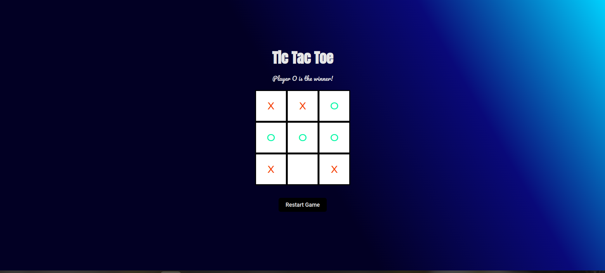

# Tic Tac Toe

> A simple Tic Tac Toe game 

## Table of contents

- [Tic Tac Toe](#tic-tac-toe)
  - [Table of contents](#table-of-contents)
  - [General info](#general-info)
  - [Screenshots](#screenshots)
  - [Technologies](#technologies)
  - [Setup](#setup)
  - [Code Examples](#code-examples)
  - [Features](#features)
  - [Status](#status)

## General info

> A simple Tic Tac Toe using HTML,CSS and Vanilla JavaScript with the implementation of Separation of Concern.

## Screenshots



## Technologies

- HTML 5
- CSS 3
- JavaScript
- VS code


## Setup

- `clone the repo or fork it`

## Code Examples

```js
const dom = {
    statusDisplay: document.getElementById('game-status'),
    container: document.getElementById("board-container"),
    restartButton: document.getElementById('restart-btn'),
    get cells() {
        return document.querySelectorAll('.cell');
    }
};

export default dom;

```

## Features

List of features ready and Todos for future development

- Interactive Tic Tac Toe game playable on desktop and mobile browsers.
- Responsive design with CSS Grid for the game board layout.
- Restart button to reset the game and start a new round.
- Display of game status (current player's turn, game result).
- Separation of concerns: JavaScript handles game logic, HTML for structure, and CSS for styling.

To-do list:

- Implement a feature to keep track of the winner
- Add transitions for smoother gameplay experience.

## Status

Project is: _Completed_


